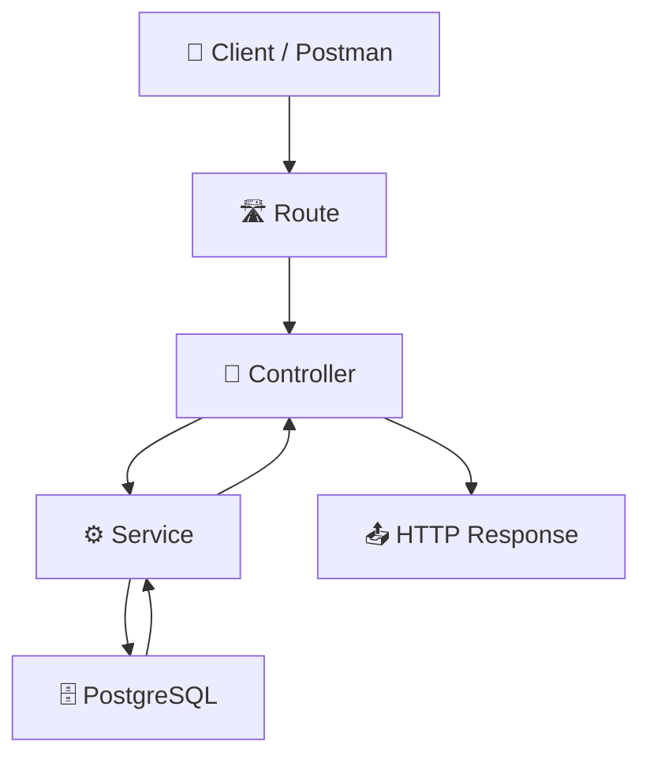
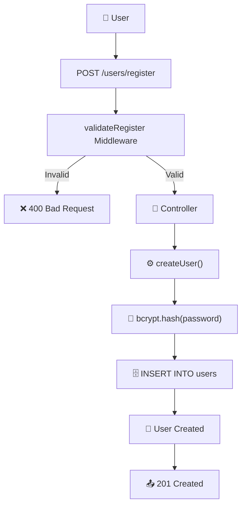
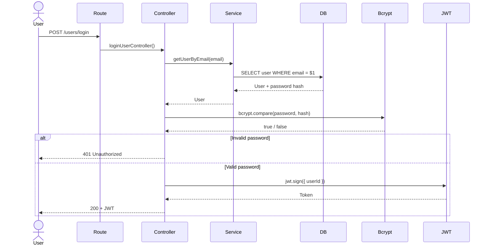
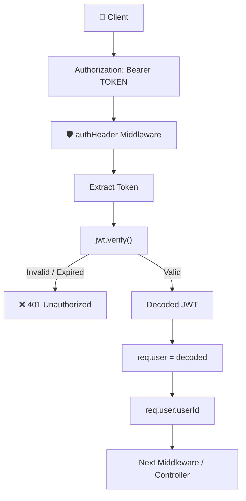
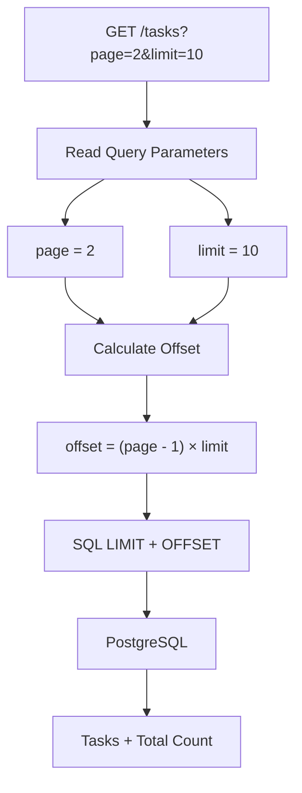
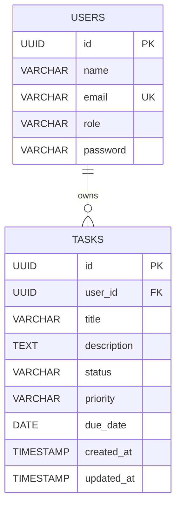
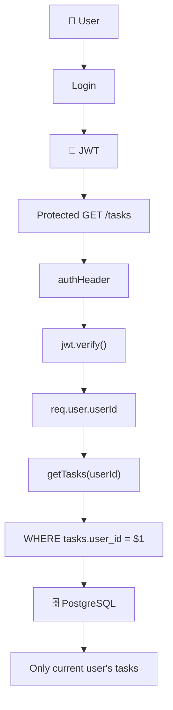
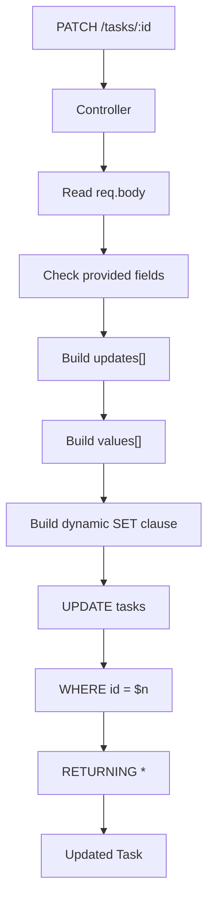
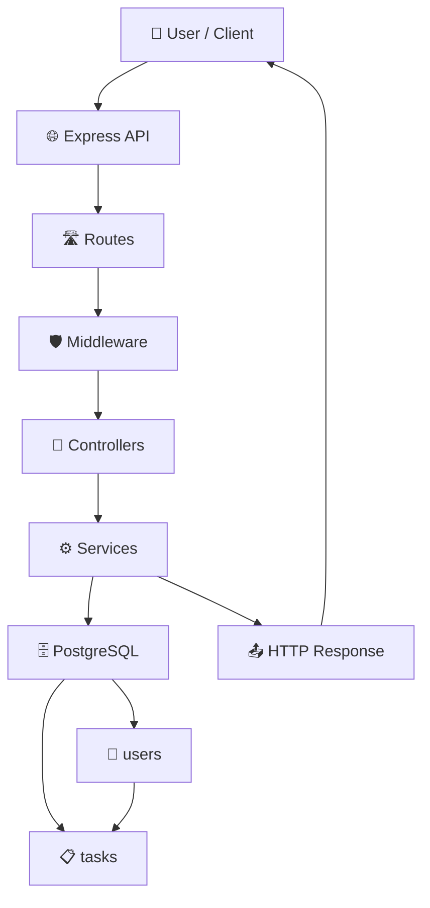

# Task Management API

A RESTful Task Management API built with **Node.js, Express.js, and PostgreSQL**.

This project was built as a practical backend learning project to understand how a real backend application is structured, how APIs communicate with databases, and how authentication and authorization work using **bcrypt and JWT**.

---

## 🚀 Features

- User CRUD
- User registration
- Password hashing with bcrypt
- User login
- JWT authentication
- Protected routes
- Task CRUD
- Task filtering
- Task search
- Task sorting
- Pagination
- Task/User relationships
- PostgreSQL constraints
- Dynamic PATCH updates
- Parameterized SQL queries
- HTTP status codes
- Feature-based project architecture

---

# 🏗️ Architecture

The application follows a feature-based structure with a clear separation between:

- Routes
- Controllers
- Services
- Database
- Middleware

### Request Flow



### What happens?

```text
Client
  ↓
Route
  ↓
Controller
  ↓
Service
  ↓
Database
  ↓
Service
  ↓
Controller
  ↓
Response
```

Each layer has a specific responsibility.

### Route

Responsible for:

- HTTP method
- URL
- Connecting the request to the correct controller
- Applying middleware

Example:

```js
router.post("/register", validateRegister, createUserController);
```

---

### Controller

Responsible for:

- Reading `req.body`
- Reading `req.params`
- Reading `req.query`
- Calling the service
- Returning the HTTP response
- Handling HTTP-level validation

Example:

```text
Request
   ↓
Controller
   ↓
Service
   ↓
Response
```

The controller should not contain SQL queries.

---

### Service

Responsible for:

- Business logic
- Database communication
- SQL queries
- Returning database results

Example:

```js
const result = await pool.query(
  "SELECT * FROM users WHERE email = $1",
  [email]
);
```

---

### Database

PostgreSQL stores:

- Users
- Tasks
- Relationships
- Password hashes
- Constraints

---

# 📁 Project Structure

```text
task-management-api/
│
├── server.js
├── package.json
├── .env
├── .gitignore
├── README.md
│
└── src/
    │
    ├── app.js
    │
    ├── config/
    │   └── database.js
    │
    ├── middleware/
    │   ├── auth.middleware.js
    │   └── validation.middleware.js
    │
    ├── users/
    │   ├── user.routes.js
    │   ├── user.controller.js
    │   └── user.service.js
    │
    └── tasks/
        ├── task.routes.js
        ├── task.controller.js
        └── task.service.js
```

---

# 🔐 Authentication

Authentication is handled using:

- bcrypt
- JSON Web Tokens (JWT)

The authentication system has two main stages:

```text
REGISTER
   ↓
Hash Password
   ↓
Store User
   ↓
LOGIN
   ↓
Verify Password
   ↓
Generate JWT
   ↓
Use JWT on Protected Routes
```

---

# 📝 User Registration

Endpoint:

```http
POST /users/register
```

The user sends:

```json
{
  "name": "Mohammed",
  "email": "mohammed@example.com",
  "password": "password123"
}
```

### Registration Flow



### Password Security

The plain password is never stored directly.

Instead:

```text
User Password
     ↓
bcrypt.hash()
     ↓
Password Hash
     ↓
PostgreSQL
```

Example:

```text
password123

↓

$2b$10$....
```

The database stores the hash, not the original password.

---

# 🔑 User Login

Endpoint:

```http
POST /users/login
```

Request:

```json
{
  "email": "mohammed@example.com",
  "password": "password123"
}
```

### Login Flow



### Login Logic

```text
Email
  ↓
Find User
  ↓
User exists?
  ├── No → 401
  │
  └── Yes
        ↓
   bcrypt.compare()
        ↓
 Password correct?
   ├── No → 401
   │
   └── Yes
        ↓
    jwt.sign()
        ↓
      JWT
```

---

# 🎫 JWT Authentication

After successful login, the server creates a JWT.

The token contains the user's ID:

```js
jwt.sign(
  { userId: loginUser.id },
  process.env.JWT_SECRET,
  { expiresIn: "1h" }
);
```

The client then sends the token with protected requests.

Example:

```http
Authorization: Bearer <token>
```

---

# 🛡️ Authentication Middleware

Protected routes use authentication middleware.

### JWT Flow



The important relationship is:

```text
JWT
 ↓
jwt.verify()
 ↓
decoded
 ↓
req.user
 ↓
req.user.userId
```

This is how the backend knows **which authenticated user is making the request**.

---

# 👤 Users

## User Endpoints

| Method | Endpoint | Description |
|---|---|---|
| GET | `/users` | Get all users |
| GET | `/users/:id` | Get user by ID |
| POST | `/users/register` | Register a user |
| POST | `/users/login` | Login |
| PUT | `/users/:id` | Replace user data |
| PATCH | `/users/:id` | Partially update user |
| DELETE | `/users/:id` | Delete user |

---

# 📋 Tasks

The API supports:

- Creating tasks
- Reading tasks
- Updating tasks
- Partially updating tasks
- Deleting tasks
- Filtering
- Searching
- Sorting
- Pagination

---

# 🔎 Task Filtering

Tasks can be filtered using query parameters.

Example:

```http
GET /tasks?status=completed
```

Multiple filters:

```http
GET /tasks?status=pending&priority=high
```

Search:

```http
GET /tasks?search=database
```

Sorting:

```http
GET /tasks?sort=priority&order=DESC
```

Pagination:

```http
GET /tasks?page=2&limit=10
```

Multiple options can also be combined:

```http
GET /tasks?status=pending&priority=high&search=api&sort=created_at&order=DESC&page=1&limit=10
```

---

# 📄 Pagination Flow



The offset calculation is:

```text
offset = (page - 1) × limit
```

Example:

```text
Page 1 → offset 0
Page 2 → offset 10
Page 3 → offset 20
```

---

# 🔗 Database Relationship

A user can have multiple tasks.



Relationship:

```text
             USERS
               │
               │ 1
               │
               │
               │ N
               ▼
             TASKS
```

One user can own many tasks.

---

# 🔗 JOIN Example

Tasks can be joined with users using:

```sql
SELECT
    tasks.id AS task_id,
    tasks.title,
    tasks.status,
    users.name AS user_name,
    users.email AS user_email
FROM tasks
INNER JOIN users
ON tasks.user_id = users.id;
```

The relationship is:

```text
tasks.user_id
      │
      │ matches
      ▼
users.id
```

---

# 🔐 User-Specific Tasks

Authentication gives us:

```js
req.user.userId
```

This allows the API to identify the current user.

The task query can then use:

```sql
WHERE tasks.user_id = $1
```

where:

```text
$1 = req.user.userId
```

### Flow



This is the foundation for **authorization**.

---

# ✏️ Dynamic PATCH

The API supports partial task updates.

Example:

```http
PATCH /tasks/:id
```

Request:

```json
{
  "status": "completed"
}
```

Only the provided field is updated.

Another request:

```json
{
  "title": "Learn PostgreSQL",
  "priority": "high"
}
```

Only `title` and `priority` are updated.

### Dynamic PATCH Flow



The important idea is:

```text
Only fields sent by the client
        ↓
are included in UPDATE
```

---

# 🗄️ Database Schema

## Users

```sql
users
```

| Column | Type | Constraint |
|---|---|---|
| id | UUID | Primary Key |
| name | VARCHAR(255) | NOT NULL |
| email | VARCHAR(255) | UNIQUE + NOT NULL |
| role | VARCHAR(20) | DEFAULT 'user' |
| password | VARCHAR(255) | Password Hash |

---

## Tasks

```sql
tasks
```

| Column | Type | Constraint |
|---|---|---|
| id | UUID | Primary Key |
| user_id | UUID | Foreign Key |
| title | VARCHAR(255) | NOT NULL |
| description | TEXT | Optional |
| status | VARCHAR(20) | CHECK |
| priority | VARCHAR(20) | CHECK |
| due_date | DATE | Optional |
| created_at | TIMESTAMP | Default |
| updated_at | TIMESTAMP | Default |

---

# 🔒 Database Constraints

The database uses constraints to protect data integrity.

### Primary Key

Uniquely identifies each record.

```text
users.id
tasks.id
```

### Foreign Key

Connects tasks to users.

```text
tasks.user_id → users.id
```

### UNIQUE

Prevents duplicate emails.

```text
users.email
```

### NOT NULL

Requires a value.

```text
users.name
users.email
tasks.title
```

### CHECK

Restricts allowed values.

Example:

```text
status:
pending
in_progress
completed
```

Example:

```text
priority:
low
medium
high
```

### ON DELETE CASCADE

If a user is deleted, their related tasks can also be deleted.

```text
DELETE USER
    ↓
USER DELETED
    ↓
RELATED TASKS DELETED
```

---

# 🛡️ SQL Injection Protection

The project uses parameterized queries.

Instead of:

```js
`SELECT * FROM users WHERE email = '${email}'`
```

the project uses:

```js
const result = await pool.query(
  "SELECT * FROM users WHERE email = $1",
  [email]
);
```

The values are passed separately from the SQL query.

```text
SQL Query
    +
Parameters
    ↓
PostgreSQL
```

This helps protect the application from SQL injection.

---

# 📡 HTTP Status Codes

The API uses standard HTTP status codes.

| Status | Meaning |
|---|---|
| 200 | Successful request |
| 201 | Resource created |
| 204 | Successful deletion with no response body |
| 400 | Bad request |
| 401 | Authentication required / invalid credentials |
| 404 | Resource not found |
| 409 | Conflict |
| 500 | Internal server error |

---

# 🧪 Testing

API requests can be tested using:

- Postman
- Insomnia
- REST Client
- cURL

Example:

```http
POST http://localhost:3000/users/register
```

```json
{
  "name": "Mohammed",
  "email": "mohammed@example.com",
  "password": "password123"
}
```

Login:

```http
POST http://localhost:3000/users/login
```

Then use the returned JWT:

```http
Authorization: Bearer <token>
```

---

# ⚙️ Environment Variables

Create a `.env` file:

```env
PORT=3000

DB_HOST=localhost
DB_PORT=5432
DB_USER=your_user
DB_PASSWORD=your_password
DB_NAME=task_management

JWT_SECRET=your_secret
```

Never commit `.env` to GitHub.

Add it to `.gitignore`:

```gitignore
.env
node_modules/
```

---

# 📦 Installation

Clone the repository:

```bash
git clone <your-repository-url>
```

Navigate to the project:

```bash
cd task-management-api
```

Install dependencies:

```bash
npm install
```

Create your `.env` file.

Then start the server:

```bash
npm run dev
```

The API should be available at:

```text
http://localhost:3000
```

---

# 📚 Technologies Used

### Backend

- Node.js
- Express.js

### Database

- PostgreSQL
- node-postgres (`pg`)

### Authentication

- JSON Web Token (`jsonwebtoken`)
- bcrypt

### Development

- Postman
- Git
- GitHub
- dotenv

---

# 🧠 What I Learned

This project was built as a learning journey into backend development.

Throughout the project I practiced:

### Backend Architecture

- REST API architecture
- Feature-based project structure
- Routes
- Controllers
- Services
- Middleware

### Node.js / Express

- Express routing
- Middleware
- Request/response lifecycle
- `req.params`
- `req.body`
- `req.query`
- Async/await
- Error handling

### PostgreSQL

- Tables
- UUID
- Primary Keys
- Foreign Keys
- Constraints
- UNIQUE
- NOT NULL
- DEFAULT
- CHECK
- JOINs
- INSERT
- SELECT
- UPDATE
- DELETE
- RETURNING
- Parameterized queries

### API Design

- CRUD operations
- Filtering
- Searching
- Sorting
- Pagination
- HTTP status codes
- PUT vs PATCH

### Authentication

- Password hashing
- bcrypt
- Password comparison
- JWT
- Bearer tokens
- Authentication middleware
- `req.user`

### Security

- SQL injection prevention
- Password hashing
- Environment variables
- Protected routes

---

# 🗺️ Current Backend Architecture

The complete mental model of the application:



---

# 🔄 Complete Authentication Mental Model

```mermaid
flowchart LR

    A["👤 User"] --> B["Register"]

    B --> C["bcrypt.hash"]

    C --> D["🗄️ Database"]

    D --> E["Login"]

    E --> F["bcrypt.compare"]

    F --> G["jwt.sign"]

    G --> H["🎫 JWT"]

    H --> I["Protected Request"]

    I --> J["jwt.verify"]

    J --> K["req.user.userId"]

    K --> L["Authorization"]

```



---

# 🎯 Project Learning Roadmap

```text
✅ Express Setup
        ↓
✅ PostgreSQL Connection
        ↓
✅ Users CRUD
        ↓
✅ Tasks CRUD
        ↓
✅ SQL Relationships
        ↓
✅ JOINs
        ↓
✅ Filtering
        ↓
✅ Search
        ↓
✅ Sorting
        ↓
✅ Pagination
        ↓
✅ Dynamic PATCH
        ↓
✅ Input Validation
        ↓
✅ Password Hashing
        ↓
✅ Registration
        ↓
✅ Login
        ↓
✅ JWT Authentication
        ↓
🔄 User-specific Tasks
        ↓
⬜ Authorization / Ownership
        ↓
⬜ Role-based Authorization
        ↓
⬜ Centralized Error Handling
        ↓
⬜ Automated Tests
        ↓
⬜ Prisma
        ↓
⬜ Deployment
```

---

# 📌 Main Concept

The main concept I am learning through this project is:

```text
                    REQUEST
                       │
                       ▼
                    ROUTE
                       │
                       ▼
                  CONTROLLER
                       │
                       ▼
                    SERVICE
                       │
                       ▼
                   DATABASE
                       │
                       ▼
                    SERVICE
                       │
                       ▼
                  CONTROLLER
                       │
                       ▼
                   RESPONSE
```

For authenticated requests:

```text
REQUEST
   │
   ▼
JWT
   │
   ▼
Authentication
   │
   ▼
req.user.userId
   │
   ▼
Authorization
   │
   ▼
Business Logic
   │
   ▼
Database
```

This project is not only about building a Task API.

It is a practical way to understand **how the different pieces of a backend application communicate with each other**.
